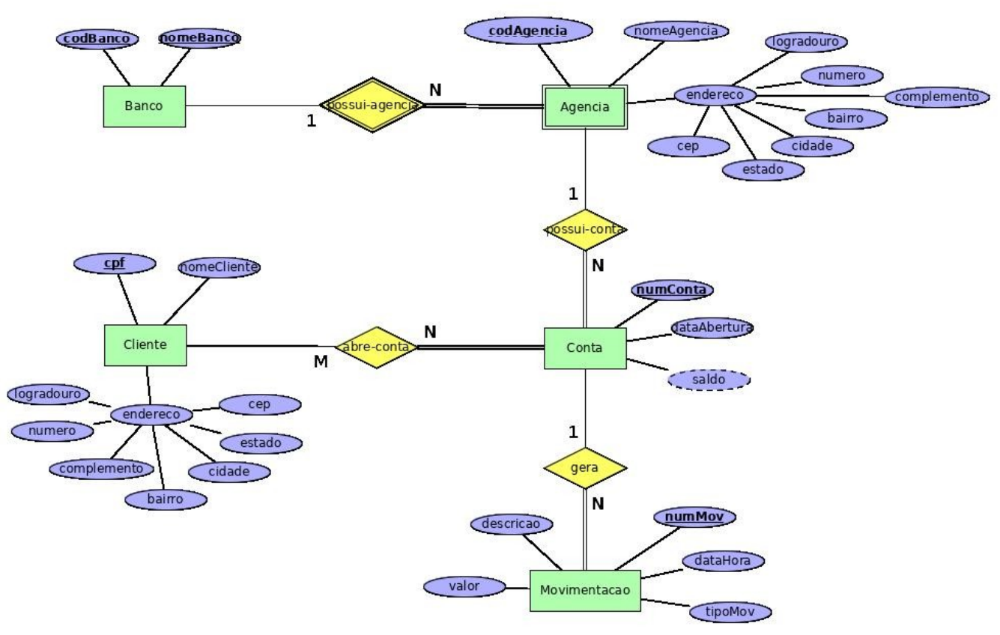

# Sistema Bancário

Considere o seguinte diagrama ER. Ele representa o banco de dados de um sistema bancário. 

Apresente o esquema relacional correspondente ao seu mapeamento ER-Relacional. 

Deixe indicado claramente a chave primária, as chaves secundárias e as chaves estrangeiras (com suas opções de exclusão) de cada tabela, se existirem.

    

## Solução

* Banco (<ins>codBanco</ins>, *nomeBanco*)

* Agencia (<ins>codAgencia</ins>, <ins>codBanco</ins>, nomeAgencia, logradouro, numero, complemento, bairro, cidade, estado, cep)
    * Agencia[codBanco] $\rightarrow ^{p}$ Banco[codBanco]

* Conta (<ins>numConta</ins>, codAgencia, codBanco, dataAbertura, saldo)
    * Conta[codAgencia, codBanco] $\rightarrow ^{b}$ Agencia[codAgencia, codBanco]

* Cliente (<ins>cpf</ins>, nomeCliente, logradouro, numero, complemento, bairro, cidade, estado, cep)

* AbreConta(<ins>cpf</ins>, <ins>numConta</ins>)
    * AbreConta[cpf] $\rightarrow ^{p}$ Cliente[cpf]
    * AbreConta[numConta] $\rightarrow ^{p}$ Conta[numConta]

* Movimentacao (<ins>numMovimentacao</ins>, numConta, dataHora, tipoMov, valor, descricao)
    * Movimentacao[numConta] $\rightarrow ^{b}$ Conta[numConta]