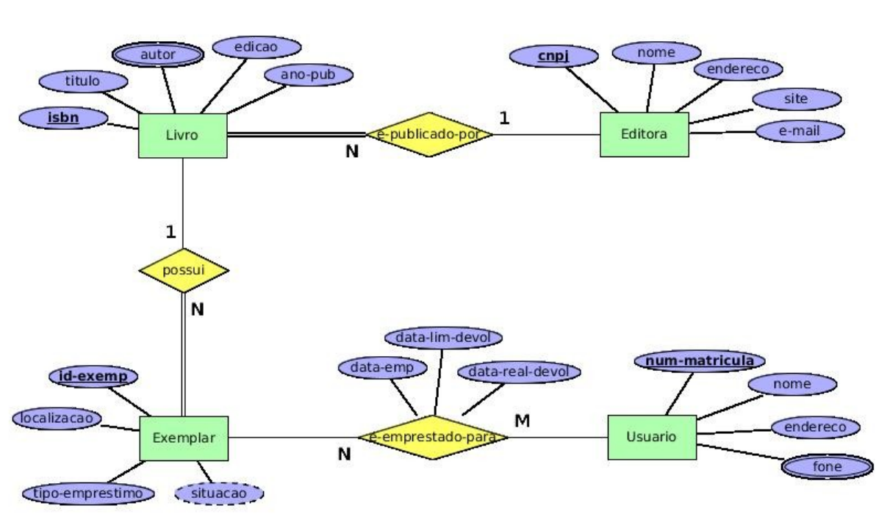

# Sistema de uma Biblioteca

Considere o seguinte diagrama ER. Ele representa o banco de dados de um sistema de empréstimos de livros de uma biblioteca universitária. 

Apresente o esquema relacional correspondente ao seu mapeamento ER-Relacional. 

Deixe indicado claramente a chave primária, as chaves secundárias e as chaves estrangeiras (com suas opções de exclusão) de cada tabela, se existirem.

    

## Solução

* Editora (<ins>cnpj</ins>, nome, endereco, site, e-mail)

* Livro (<ins>isbn</ins>, titulo, edicao, anoPublicacao, cnpjEditora)
    * Livro[cnpjEditora] $\rightarrow ^{b}$ Editora[cnpj]

* LivroAutor (<ins>isbn</ins>, <ins>autor</ins>)
    * LivroAutor[isbn] $\rightarrow ^{p}$ Livro[isbn]

* Exemplar (<ins>idExemplar</ins>, localizacao, tipoEmprestimo, isbn)
    * Exemplar[isbn] $\rightarrow ^{b}$ Livro[isbn]

* Usuario (<ins>numMatricula</ins>, nome, endereco)

* UsuarioFone (<ins>numMatricula</ins>, <ins>fone</ins>)
    * UsuarioFone[numMatricula] $\rightarrow ^{p}$ Usuario[numMatricula]

* Emprestimo (<ins>idExemplar</ins>, <ins>numMatricula</ins>, dataEmp, dataLimDevol, dataRealDevol)
    * Emprestimo[idExemplar] $\rightarrow ^{p}$ Exemplar[idExemplar]
    * Emprestimo[numMatricula] $\rightarrow ^{p}$ Usuario[numMatricula]