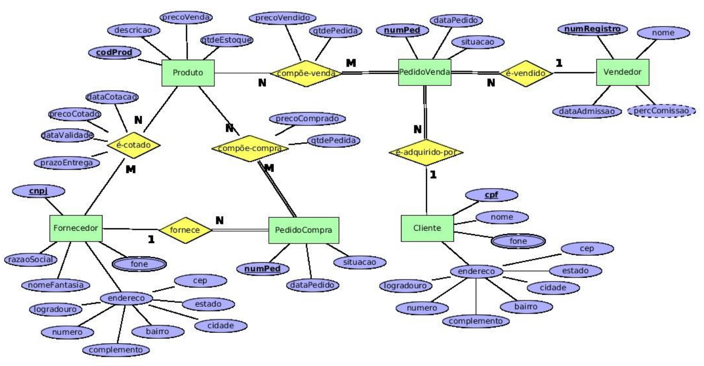

# Loja de Produtos

Considere o seguinte diagrama ER. Ele representa o banco de dados de um sistema de compras e vendas de uma loja de produtos de informática. 

Apresente o esquema relacional correspondente ao seu mapeamento ERRelacional. 

Deixe indicado claramente a chave primária, as chaves secundárias e as chaves estrangeiras (com suas opções de exclusão) de cada tabela, se existirem.

    

## Solução