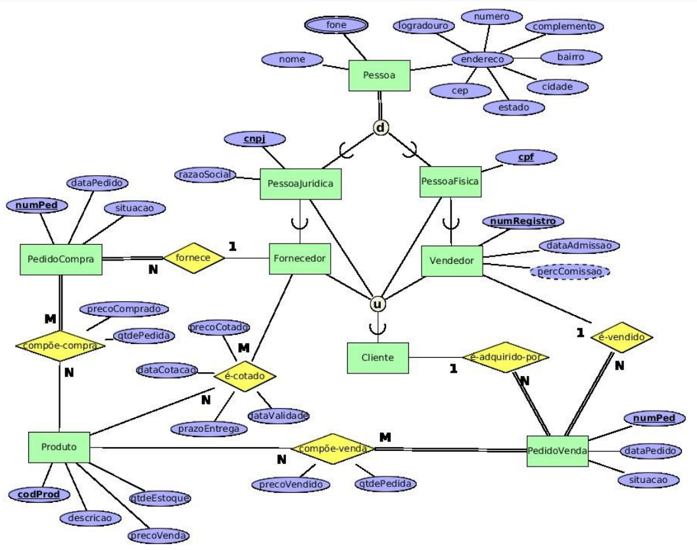

# Loja de Produtos v2

Considere o seguinte diagrama ER. Ele representa o banco de dados de um sistema de compras e vendas de uma loja de produtos de informática. 

Apresente o esquema relacional correspondente ao seu mapeamento ERRelacional. 

Deixe indicado claramente a chave primária, as chaves secundárias e as chaves estrangeiras (com suas opções de exclusão) de cada tabela, se existirem.

    

## Solução

* Pessoa (<ins>idPessoa</ins>, idCliente, nome, logradouro, numero, complemento, bairro, cidade, estado, cep)
    * Pessoa[idCliente] $\rightarrow ^{n}$ Cliente[idCliente]

* FonePessoa(<ins>idPessoa</ins>, <ins>fone</ins>)
    * FonePessoa[idPessoa] $\rightarrow ^{p}$ Pessoa[idPessoa]

* PessoaJuridica (<ins>idPessoa</ins>, *cnpj*, razaoSocial, ehFornecedor)
    * PessoaJuridica[idPessoa] $\rightarrow ^{p}$ Pessoa[idPessoa]

* PessoaFisica (<ins>idPessoa</ins>, *cpf*)
    * PessoaFisica[idPessoa] $\rightarrow ^{p}$ Pessoa[idPessoa]

* Vendedor (<ins>idPessoa</ins>, *numRegistro*, dataAdmissao)
    * Vendedor[idPessoa] $\rightarrow ^{p}$ PessoaFisica[idPessoa]

* Cliente (<ins>idCliente</ins>)

* PedidoCompra (<ins>numPedido</ins>, idPessoa, dataPedido, situacao)
    * PedidoCompra[idPessoa] $\rightarrow ^{b}$ PessoaJuridica[idPessoa]

* Produto (<ins>codProduto</ins>, descricao, precoVenda, quantidadeEstoque)

* ProdutoCompra (<ins>codProduto</ins>, <ins>numPedido</ins>, precoComprado, quantidade)
    * ProdutoCompra[codProduto] $\rightarrow ^{p}$ Produto[codProduto]
    * ProdutoCompra[numPedido] $\rightarrow ^{p}$ PedidoCompra[numPedido]

* Orcamento (<ins>codProduto</ins>, <ins>idPessoa</ins>, dataCotacao, precoCotado, dataValidade, prazoEntrega)
    * Orcamento[codProduto] $\rightarrow ^{p}$ Produto[codProduto]
    * Orcamento[idPessoa] $\rightarrow ^{p}$ PessoaJuridica[idPessoa]

* PedidoVenda (<ins>numPedido</ins>, idPessoa, idCliente, dataPedido, situacao)
    * PedidoVenda[idPessoa] $\rightarrow ^{b}$ Vendedor[idPessoa]
    * PedidoVenda[idCliente] $\rightarrow ^{b}$ Cliente[idCliente]

* ProdutoVenda (<ins>codProduto</ins>, <ins>numPedido</ins>, precoVendido, quantidade)
    * ProdutoVenda[codProduto] $\rightarrow ^{p}$ Produto[codProduto]
    * ProdutoVenda[numPedido] $\rightarrow ^{p}$ PedidoVenda[numPedido]