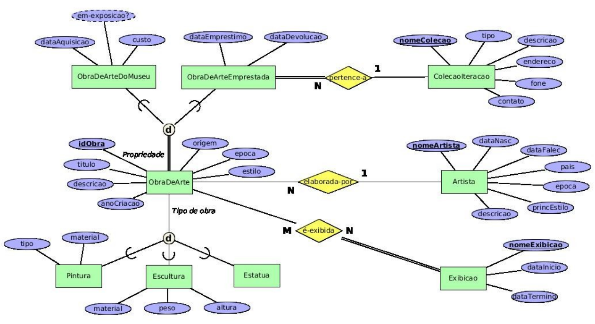

# Museu de Artes

Considere o seguinte diagrama ER. Ele representa o banco de dados de um sistema de um museu de artes.

Apresente o esquema relacional correspondente ao seu mapeamento ERRelacional. 

Deixe indicado claramente a chave primária, as chaves secundárias e as chaves estrangeiras (com suas opções de exclusão) de cada tabela, se existirem.

    

## Solução

* ColecaoIteracao (<ins>idColecao</ins>, *nomeColecao*, tipo, descricao, endereco, fone, contato)

* Artista (<ins>idArtista</ins>, *nomeArtista*, dataNasc, dataFalec, pais, epoca, principalEstilo, descricao)

* Exibicao (<ins>idExibicao</ins>, *nomeExibicao*, dataInicio, dataTermino)

* ObraArte (<ins>idObra</ins>, idArtista, titulo, descricao, anoCriacao, origem, epoca, estilo)
    * ObraArte[idArtista] $\rightarrow ^{b}$ Artista[idArtista]

* Pintura (<ins>idObra</ins>, tipo, material)
    * Pintura[idObra] $\rightarrow ^{p}$ ObraArte[idObra]

* Escultura (<ins>idObra</ins>, material, peso, altura)
    * Escultura[idObra] $\rightarrow ^{p}$ ObraArte[idObra]

* ObraArteMuseu (<ins>idObra</ins>, dataAquisicao, custo)
    * ObraArteMuseu[idObra] $\rightarrow ^{p}$ ObraArte[idObra]

* ObraArteEmprestada (<ins>idObra</ins>, idColecao, dataEmprestimo, dataDevolucao)
    * ObraArteEmprestada[idObra] $\rightarrow ^{p}$ ObraArte[idObra]
    * ObraArteEmprestada[idColecao] $\rightarrow ^{b}$ ColecaoIteracao[idColecao]

* ExbicaoObra (<ins>idObra</ins>, <ins>idExibicao</ins>)
    * ExbicaoObra[idObra] $\rightarrow ^{p}$ ObraArte[idObra]
    * ExbicaoObra[idExibicao] $\rightarrow ^{p}$ Exibicao[idExibicao]
