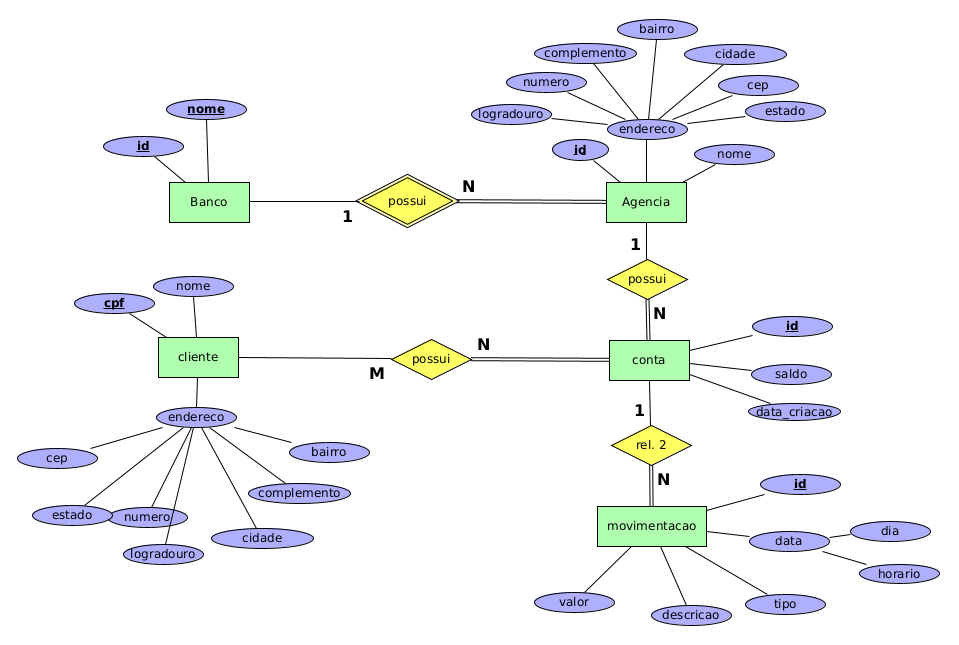

# Sistema de Controle Bancário

Faça um diagrama ER para um sistema de controle bancário a partir das seguintes informações:

* Cada banco tem um nome e um código de identificação no sistema bancário. Ambos são únicos no sistema.

* Cada banco possui um conjunto de agências, onde os clientes abrem suas contas. Cada agência possui um código de identificação, que é único dentro de cada banco (agências de bancos diferentes podem ter o mesmo código), um nome e um endereço (logradouro, no , complemento, bairro, cidade, cep, estado).

* Dos clientes são necessárias as seguintes informações: cpf, nome e endereço (logradouro, no , complemento, bairro, cidade, cep, estado). Considere que o cpf identifica unicamente cada cliente.

* As contas são somente do tipo conta-corrente e possuem um número de identificação, que é único dentro do sistema, e um saldo. As contas podem ser individuais (de um único cliente) ou conjuntas (pertencerem a mais de um cliente). Um cliente pode ter mais de uma conta em uma mesma agência. É necessário saber também a data em que cada conta foi aberta. As contas possuem movimentações (ou transações) para as quais deve-se manter um controle histórico. Cada movimentação possui um número de identificação, que é único dentro do sistema, a data e o horário em que ela ocorreu, o tipo de movimentação (débito ou crédito), a descrição da movimentação e o valor movimentado. 

## Modelagem do Problema

Uma das possíveis soluções para a [modelagem do problema](banco.xml) descrito é:

    

