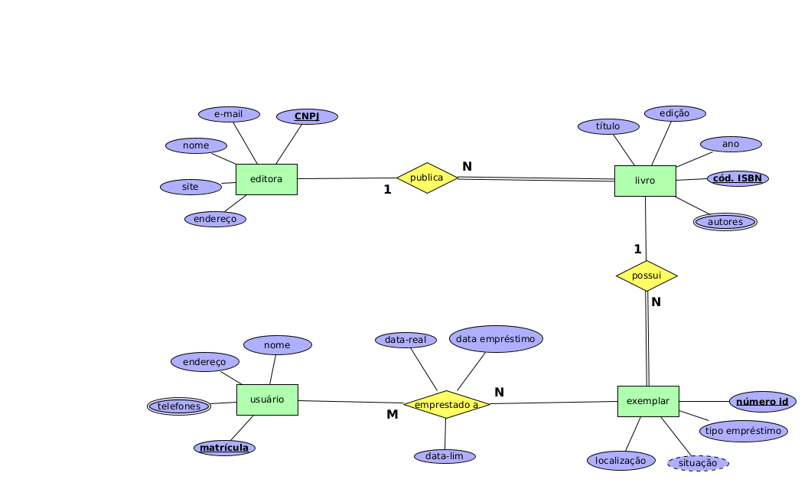

# Empréstimo de Livros - Biblioteca

Faça um diagrama ER para um sistema de empréstimos de livros de uma biblioteca, a partir das seguintes informações:

* A biblioteca possui um cadastro de livros e, para cada livro, são necessárias as seguintes informações: código ISBN (código internacional de livros, único no sistema), título, nome(s) do(s) autor(es), edição, ano de publicação e editora (CNPJ, nome, endereço, site e e-mail). A biblioteca possui vários exemplares de cada livro disponíveis para empréstimo. Cada exemplar possui um número de identificação  que é único no sistema, uma localização dentro da biblioteca, o tipo de empréstimo (uso exclusivo na biblioteca, uso fora da biblioteca) e uma situação (emprestado, disponível).

* Para cada exemplar de livro que for emprestado pela biblioteca, devem ser armazenadas as seguintes informações: os dados do exemplar, os dados do usuário que toma o livro emprestado (número de matrícula, nome, endereço e telefones), a data do empréstimo, a data limite para devolução e a data real de devolução, quando o livro for devolvido.

## Modelagem do Problema

Uma das possíveis soluções para a [modelagem do problema](biblioteca.xml) descrito é:

    

