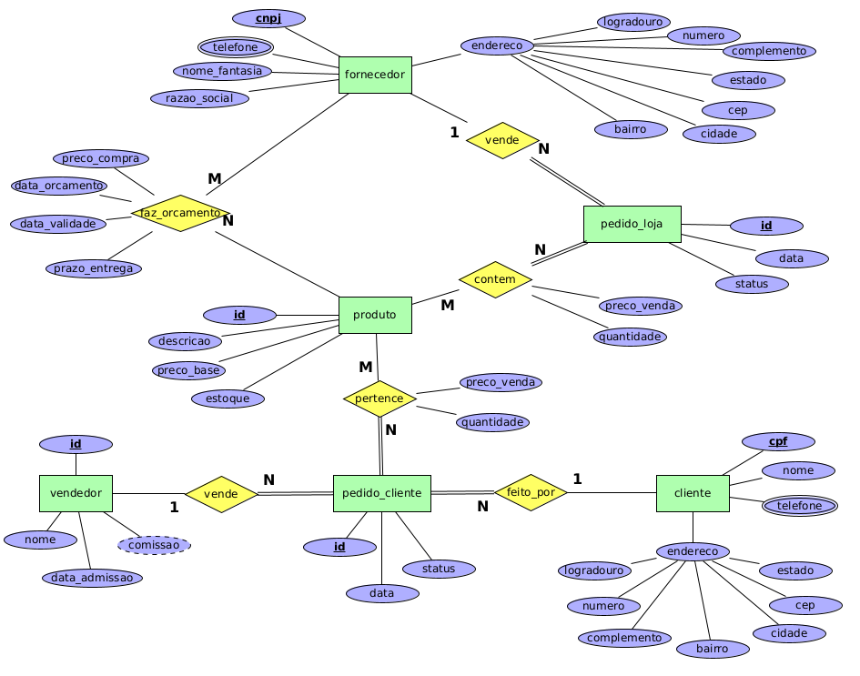

# Controle de Estoque - Loja de Informática

Faça um diagrama ER para um sistema de controle de estoque, compra e venda de uma loja de produtos de informática, a partir das seguintes informações:

* A loja possui um cadastro de produtos. Cada produto possui um código (único no sistema), uma descrição e um preço de venda. Também é necessário saber-se a quantidade disponível em estoque de cada produto.

* A loja vende produtos para seus clientes através de pedidos, que do ponto de vista da loja são os pedidos de venda. Em cada pedido de venda consta um número de identificação do pedido, a data do pedido, os dados do cliente (cpf, nome, endereço (logradouro, no , complemento, bairro, cidade, cep, estado) e telefones de contato) e a relação de produtos pedidos, incluindo o preço de venda e a quantidade pedida. Cada pedido de venda também possui uma situação indicando se ele está pendente, já foi entregue ou foi cancelado.

* A loja paga mensalmente os vendedores por meio de comissão de venda. Cada vendedor possui um número de registro na loja, um nome e uma data de admissão. Cada vendedor recebe um percentual sobre as vendas que ele efetua. Esse percentual varia de vendedor para vendedor dependendo do tempo de trabalho na loja. O percentual começa com 0,5% e aumenta em 0,5% a cada seis meses, até o limite de 3%.

* Para comprar um produto, a loja faz orçamentos com diversos fornecedores. Em cada orçamento consta os dados do fornecedor (cnpj, razão social, nome fantasia, endereço (logradouro, no , complemento, bairro, cidade, cep, estado) e telefones de contato), os dados do produto cotado, o preço de compra, a data de cotação, a data de validade do preço cotado e o prazo de entrega. Com base nos orçamentos, são feitos pedidos de compra para os fornecedores que oferecem as melhores condições. Em cada pedido de compra consta um número de identificação do pedido, a data do pedido, os dados do fornecedor e a relação de produtos pedidos, incluindo o preço e a quantidade pedida. Cada pedido possui também uma situação indicando se ele está pendente, já foi entregue ou foi cancelado. Não é necessário relacionar os pedidos de compra aos orçamentos.

## Modelagem do Problema

Uma das possíveis soluções para a [modelagem do problema](info.xml) descrito é:

    

