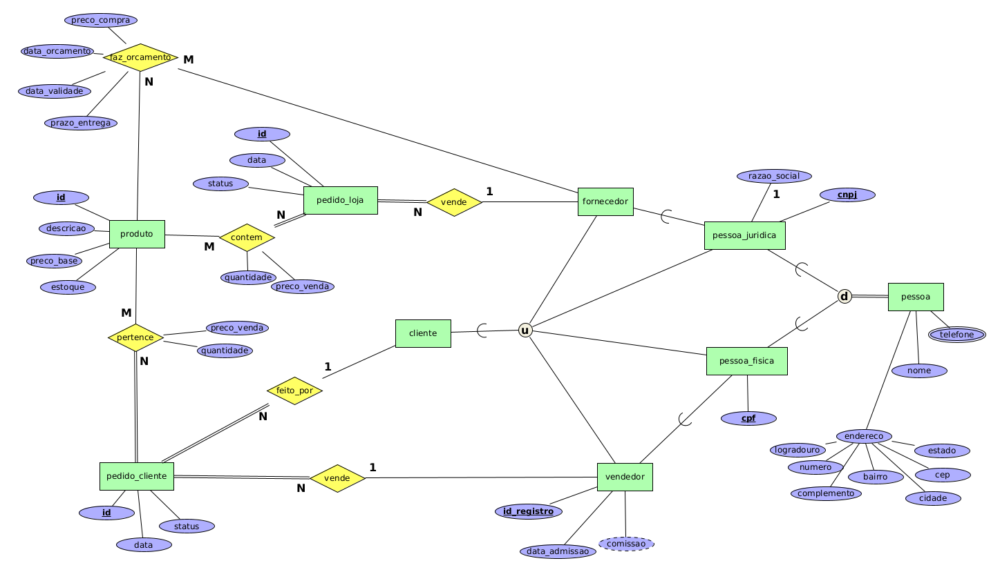

# Controle de Estoque - Loja de Informática (v2)

Altere o diagrama do exercício anterior, criando uma hierarquia para os tipos de entidades Fornecedor, Cliente e Vendedor. Considere que os fornecedores da loja são sempre pessoas jurídicas (empresas), os clientes podem ser pessoas jurídicas ou pessoas físicas e os vendedores são sempre pessoa física. Nada impede que fornecedores e vendedores sejam também clientes da loja. Considere, ainda, que vendedores também possuem os atributos endereço e telefones, como definidos para clientes e fornecedores.

## Modelagem do Problema

Uma das possíveis soluções para a [modelagem do problema](info2.xml) descrito é:

    

