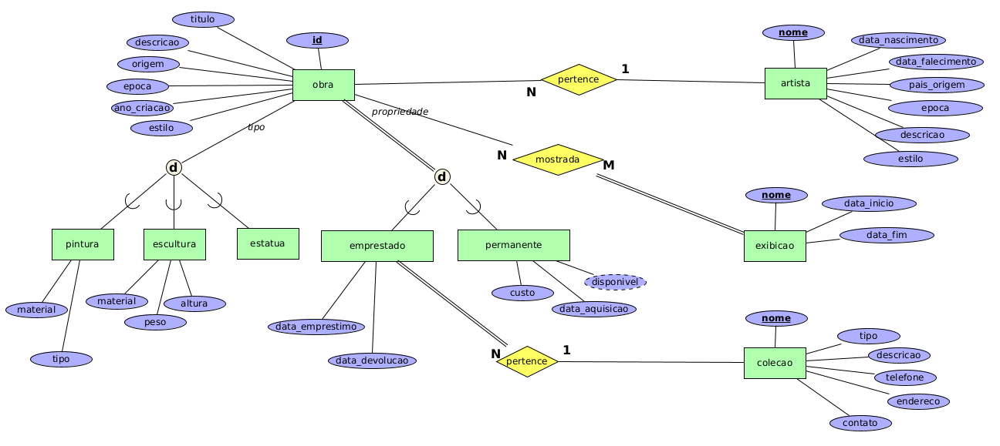

# Museu de Artes

Faça um diagrama ER para um sistema de um museu de artes, a partir das seguintes informações:

* O museu tem uma coleção de obras de arte. Cada obra de arte tem um número de identificação, um artista (se conhecido), um ano (quando a obra foi criada, se conhecido), um título e uma descrição. As obras de arte são categorizadas como pintura, escultura, estátua e outros (obras que não são dos três tipos anteriores). Uma pintura tem um tipo (óleo, água etc), um material no qual foi desenhada (papel, madeira, canvas etc) e um estilo (moderna, abstrata etc). Uma escultura tem o material em que foi criada (madeira, pedra etc), a altura, o peso e o estilo. Uma estátua tem um estilo. Uma obra de arte na categoria outros também tem um um estilo.

* As obras de arte também são categorizados como coleção permanente que são de propriedade do museu (neste caso guarda-se informações sobre data de aquisição, se a obra está em exposição ou está guardada e o custo da obra) ou como emprestados (que guarda informações sobre a coleção a que ela pertence, a data de empréstimo e a data de devolução).

* As obras de arte também guardam informações sobre o seu país/cultura de origem (italiana, egípcia etc) e a época em que foram criadas (renascimento, modernismo etc).

* O museu mantém informações sobre os artistas (se conhecidos): nome, data de nascimento, data de falecimento (se não está vivo), país de origem, época, principal estilo e descrição. O nome é tido como único.

* Ocorrem diferentes exibições, cada uma tem nome (único), data de início, data de término e uma relação de todas as obras de arte que foram mostradas durante a exibição.

* Das coleções com que o museu interage também são mantidas informações sobre nome (único), tipo (museu, pessoal etc), descrição, endereço, telefone e pessoa de contato.

## Modelagem do Problema

Uma das possíveis soluções para a [modelagem do problema](museu.xml) descrito é:

    

