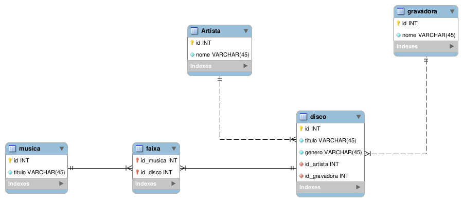

# Restrições de Integridade Referencial: Discoteca

Considere o banco de dados de uma discoteca representado pelo seguinte esquema relacional:

* Artista (<u>codArtista</u>, nomeArtista) 
* Gravadora (<u>codGravadora</u>, nomeGravadora) 
* Disco (<u>codDisco</u>, tituloDisco, genero, codArtista, codGravadora)
* Música (<u>codMusica,</u> tituloMusica)
* Faixa (<u>codDisco</u>, <u>codMusica</u>, duracao)

Indique as restrições de integridade referencial, com opção de exclusão, mais apropriadas para esse banco de dados. As opções de exclusão são: P – propagação, B – bloqueio e N – substituição por nulos. Justifique sua resposta. Depois, mostre exemplos de dados em cada tabela. 

Dica: faça o diagrama ER correspondente ao esquema relacional para ajudar na escolha das opções de exclusão mais apropriadas. Faça suposições para casos em que não e possível deduzir do esquema relacional. É um método conhecido como engenharia reversa: gerar um diagrama ER a partir do diagrama (ou esquema) relacional.

## Solução

Observe o diagrama ER correspondente ao modelo relacional:

    

Veja a opção de exclusão mais apropriada definida nos relacionamentos:

* Disco (<u>codDisco</u>, tituloDisco, genero, codArtista, codGravadora)
    * Disco[codArtista] $\rightarrow ^{b}$ Artista[codArtista]
    * Disco[codGravadora] $\rightarrow ^{b}$ Gravadora[codGravadora] 
* Faixa (<u>codDisco</u>, <u>codMusica</u>, duracao)
    * Faixa[codDisco] $\rightarrow ^{p}$ Disco[codDisco]
    * Faixa[codMusica] $\rightarrow ^{p}$ Musica[codMusica]

Na tabela "Disco", a opção de exclusão por bloqueio foi utilizada em ambas chaves estrangeiras visto que tais atributos não podem assumir valor nulo. Além disso, a opção de propagação também não é apropriada, pois "Disco" é uma entidade independente, e, dessa forma, as entidades "Artista" e "Gravadora" estariam interferindo diretamente nela.

Já no caso da entidade "Faixa", temos que considerar o fato da mesma possuir ambas chaves estrangeiras como sua chave primária, caracterizando a mesma como uma entidade fraca. Nesse caso, a deleção de uma tupla que é referenciada por outras na relação "Faixa", seja da tabela "Disco" ou "Musica", deve resultar na deleção em cascata das instâncias relacionadas. Isso, devido ao fato de "Faixa" ser uma entidade dependende de "Disco" e também de "Musica".
