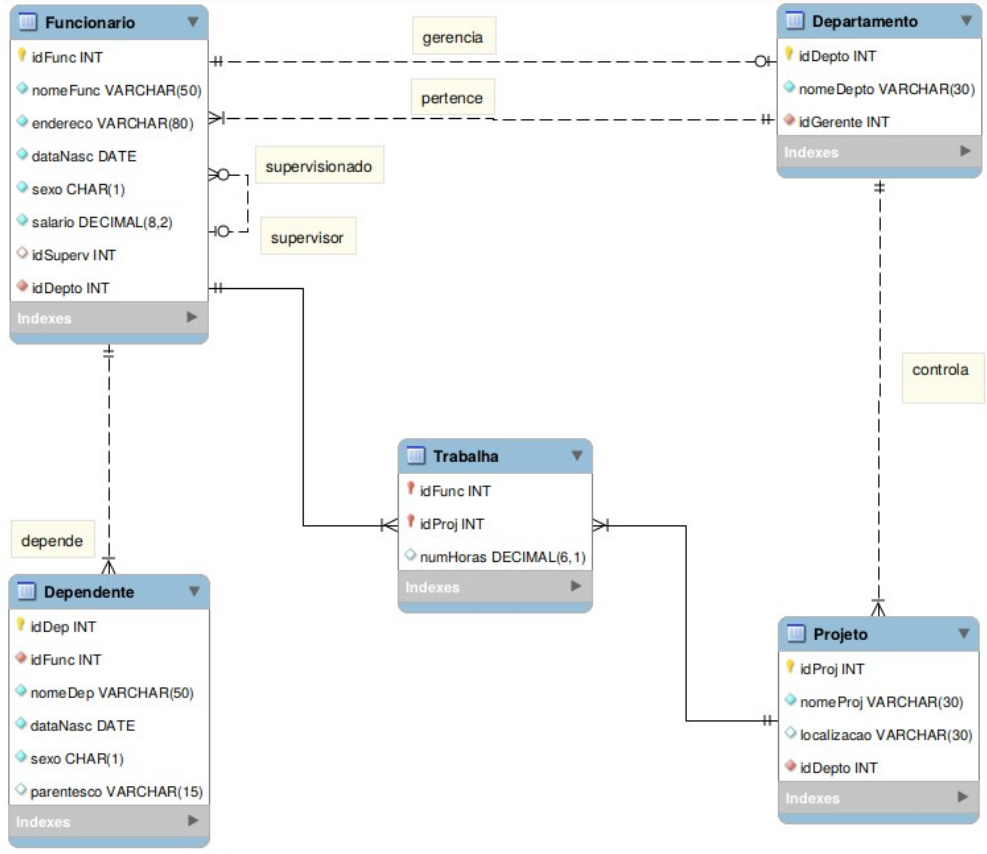

# Lista de Exercícios: Álgebra Relacional e Cálculo Relacional

## Esquema Relacional

Diagrama do banco de dados usado nos exercícios

<p align="center">
    
</p>

## Consultas no Esquema

1. Selecione o endereço e o salário do funcionário de nome ‘Luciana S. Santos’.
1. Selecione o nome e o salário dos funcionários que nasceram entre os anos de 1960 e 1969, inclusive, do sexo feminino e que ganham menos de 1000.
1. Selecione o nome dos dependentes do funcionário de nome ‘João B. Silva’.
1. Selecione o nome dos projetos que o funcionário de nome ‘Frank T. Santos’ trabalha.
1. Selecione o nome dos funcionários que trabalham em projetos controlados pelo departamento de nome ‘ Construção’.
1. Selecione o nome dos funcionários supervisionados pelo funcionário de nome ‘Frank T. Santos’.
1. Selecione o nome e endereço dos funcionários que não tem nenhum dependente.
1. Selecione o nome dos funcionários que trabalham no departamento de nome ‘Pesquisa’ ou que trabalham no projeto de nome ‘N. Benefícios’.
1. Selecione o nome dos funcionários que trabalham em algum projeto controlado pelodepartamento cujo gerente é o funcionário de nome ‘Júnia B. Mendes’.
1. Selecione o nome dos funcionários que trabalham em todos os projetos controlados pelo departamento cujo gerente é o funcionário de nome ‘Júnia B. Mendes’.
1. Selecione o nome dos funcionários e o nome de seus dependentes. Deve incluir o nome dos funcionários sem dependentes.
1. Selecione a quantidade de funcionários que trabalham no departamento que controla o projeto de nome ‘ProdZ’.
1. Selecione o nome dos funcionários e a quantidade de projetos que cada um trabalha mais de 10 horas.
1. Selecione o nome dos funcionários e a quantidade de projetos que cada um trabalha. Liste apenas os funcionários que trabalham em mais de um projeto.


## R: Álgebra Relacional

```

1-   𝚷 endereco, salario ( 𝛔 nomeFunc = “Luciana S. Santos” (Funcionario) )


2-  𝚷 nomeFunc, salario ( 𝛔 dataNasc >= ‘01/01/1960’ AND dataNasc <= ‘31/12/1969’ AND  sexo = ‘F’ AND salario < 1000 (Funcionario) )


3 -   temp ← 𝚷 idFunc (𝛔 nomeFunc='João B. Silva' (Funcionario) )
       resultado ← 𝚷 nomeDep (temp * Dependente)


4 -  temp ← 𝚷 idFunc (𝛔 nomeFunc='Frank T. Santos' (Funcionario) )
      resultado ← 𝚷 nomeProj (Projeto * (temp * Trabalha))


5 - tempDepto←𝚷 idDepto (𝛔 nomeDepto='Contrução (Departamento))
     tempProj ←𝚷 idProj (Projeto * tempDepto)
      resultado←𝚷 nomeFunc (Funcionario * (Trabalha * tempProj))


6 - temp (idSuperv) ← 𝚷 idFunc (𝛔 nomeFunc='Frank T. Santos' (Funcionario))
     resultado←𝚷 nomeFunc (temp * Funcionario)


7 -  funcDependente ←𝚷 idFunc (Dependente)
      todosFunc ←𝚷 idFunc (Funcionario)
      funcRestante ←todosFunc - funcDependente
      resultado ←𝚷 nomeFunc, endereco (funcRestante * Funcionario)


8 - deptoPesquisa ←𝚷 idDepto (𝛔 nomeDepto=”Pesquisa” (Departamento))
     funcPesquisa←𝚷 nomeFunc (Funcionario * deptoPesquisa)
     projetoBeneficio ←𝚷 idProj (𝛔 nomeProj=”N. Benefícios” (Projeto))
     funcBeneficio←𝚷 nomeFunc (Funcionario * (projetoBeneficio * Trabalha))
     resultado←funcPesquisa ⋃ funcBeneficio


9 - tempGerente(idGerente) ← 𝚷 idFunc (𝛔 nomeFunc=”Júnia B. Mendes” (Funcionario))
     tempDepto←𝚷 idDepto (tempGerente * Departamento)
      tempProjeto ←𝚷 idProj (Projeto * tempDepto)
      resultado ←𝚷 nomeFunc (Funcionario * (tempProjeto * Trabalha))


10 - tempGerente(idGerente) ← 𝚷 idFunc (𝛔 nomeFunc=”Júnia B. Mendes” (Funcionario))
       tempDepto←𝚷 idDepto (tempGerente * Departamento)
        tempProjeto ←𝚷 idProj (Projeto * tempDepto)
        tempTrabalha←𝚷 idFunc, idProj (Trabalha)
       tempFunc ←tempTrabalha ÷ tempProjeto
       resultado ←𝚷 nomeFunc (tempFunc * Funcionario)


11 - 𝚷 nomeFunc, nomeDep (Funcionario ⟕ Funcionario.idFunc=Dependente.idFunc Dependente)


12 - tempDepto ←𝚷 idDepto (Departamento * (𝛔 nomeProj=”ProdZ” (Projeto)))
       tempFunc ← Funcionario * tempDepto
       resultado ← F COUNT idFunc (tempFunc)


13 - tempTrabalha ← 𝛔 numHoras > 10 (Trabalha)
       tempFunc ← Funcionario * tempTrabalha
        resultado ← nomeFunc F COUNT idProj (tempFunc)


14 - tempFunc (nomeFunc, numProj) ← nomeFunc F COUNT idProj (Funcionario * Trabalha)
       resultado ← 𝛔 numProj > 1 (tempFunc)

```

## R: Cálculo Relacional